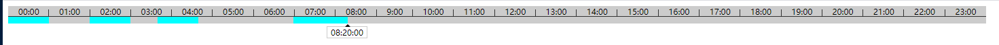

## 预览



## 安装

``` bash
$ npm install vue-back-time-line -S
```
## 使用

在 `main.js` 文件中引入插件并注册

``` bash
# main.js
import VueBackTimeLine from 'vue-back-time-line'
import 'vue-back-time-line/lib/back-time-line.css'
Vue.use(VueBackTimeLine)
```

在项目中用使用 VueBackTimeLine


```js
<template>
  <div>
    <back-time-line :timeData="timeData" @onTimeItem="onTimeItem" />
  </div>
</template>
<script>
  export default {
    data() {
      return {
        timeData: [
          {
            sTime: 0,
            eTime: 60
          },
        ]
      }
    },
    methods: {
      onTimeItem(val) {
        console.log(val);
      }
    }
  }
</script>
```

注意：标签为 `<back-time-line>`

## 参数

| 参数 | 类型 | 默认值 | 说明 |
| ------ | ------ | ------ | ------ |
| timeData | Array | [] | 数组中为对象 { sTime: 0, eTime: 60, ...} sTime 起始 eTime 长度 ... 自定义添加|


## 事件

| 事件名称 | 回调参数 | 回调类型 |
| ------ | ------ | ------ |
| onTimeItem | item | Object |

## onTimeItem 事件详解
回调的数据为对象{eTime: 60, lefTime: "00:53:00", left: 53, sTime: 0, ...} sTime 起始 eTime 长度 lefTime 时间点 left 距0点的长度px ... 自定义添加